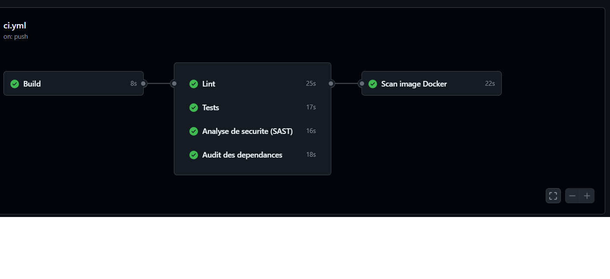
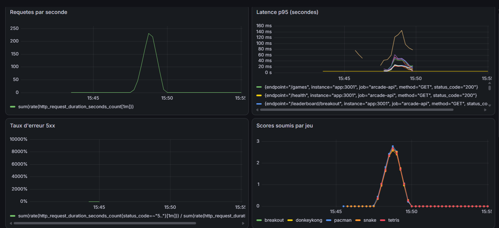
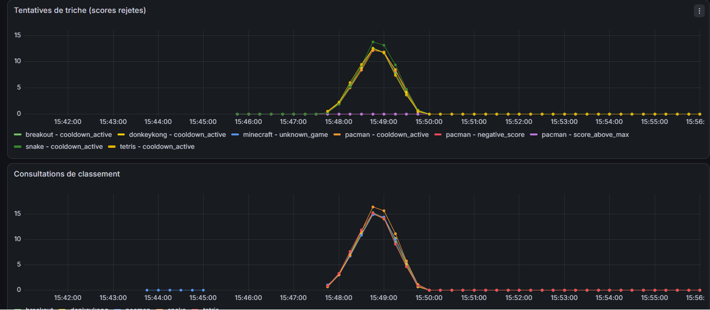
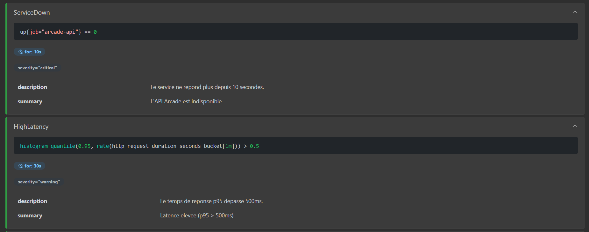
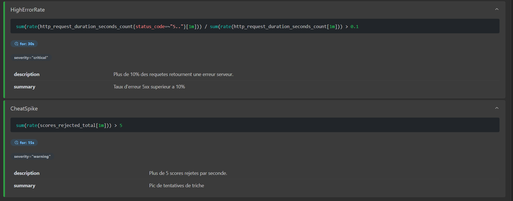

DEMANGE Sébastien - HERGOTT Emilien

# Retro Arcade Leaderboard

API de classements multi-jeux pour bornes d'arcade retro (Pac-Man, Tetris, Snake, Breakout, Donkey Kong). Le projet couvre toute la chaine DevOps : conteneurisation, CI/CD, monitoring, alerting et test de charge.

## Stack technique

| Composant | Technologie | Justification |
|-----------|-------------|---------------|
| API | Node.js / Express | Leger, rapide a mettre en place, large ecosysteme |
| Base de donnees | MySQL 8 | Robuste, performant pour les requetes de classement |
| Cache | Redis | Utilise pour le rate limiting et le cooldown anti-triche |
| Monitoring | Prometheus + Grafana | Standard de l'industrie pour le monitoring d'applications |
| Conteneurisation | Docker + Docker Compose | Orchestration simple, environnements dev/prod distincts |
| Tests | Jest | Framework de test standard pour Node.js |
| CI | GitHub Actions | Integration native avec GitHub, gratuit pour les repos publics |
| SAST | Semgrep | Analyse de securite statique pour Node.js |
| Scan image | Trivy | Detection de vulnerabilites dans les images Docker |
| Linter | ESLint | Analyse statique et qualite du code JavaScript |
| Test de charge | k6 | Scriptable en JS, rapports detailles, integration Grafana |

## Lancer le projet

### Mode developpement

```bash
docker compose up --build
```

Le fichier `docker-compose.override.yml` est applique automatiquement :
- Code source monte en volume (hot-reload avec nodemon)
- Ports MySQL et Redis exposes pour le debug
- Logs verbeux

### Mode production

```bash
docker compose -f docker-compose.yml up --build -d
```

Seul le fichier `docker-compose.yml` est utilise :
- Image construite en multi-stage (pas de montage du code source)
- L'application tourne avec l'utilisateur `node` (non root)
- Politique de redemarrage automatique
- Seuls les ports necessaires sont exposes

## Acces aux services

| Service     | URL                                     |
|-------------|-----------------------------------------|
| API         | http://localhost:3001                    |
| phpMyAdmin  | http://localhost:8080                    |
| Prometheus  | http://localhost:9090                    |
| Grafana     | http://localhost:3000 (admin / admin)    |

## Routes de l'API

| Methode | Route                  | Description                          |
|---------|------------------------|--------------------------------------|
| POST    | `/scores`              | Soumettre un score                   |
| GET     | `/leaderboard/{game}`  | Classement d'un jeu (top N)          |
| GET     | `/players/{player}`    | Meilleurs scores d'un joueur         |
| GET     | `/games`               | Liste des jeux geres                 |
| GET     | `/health`              | Etat de sante du service             |
| GET     | `/metrics`             | Metriques Prometheus                 |

## Regles anti-triche

Un score est rejete si :
- Le jeu n'existe pas (400)
- Le score est negatif (400)
- Le score depasse le maximum autorise du jeu (422)
- Le joueur soumet trop vite : cooldown de 2 secondes entre deux soumissions du meme joueur sur le meme jeu (429)

Chaque rejet est comptabilise dans les metriques Prometheus avec son motif.

## Conteneurisation

- **Dockerfile multi-stage** : le premier stage installe les dependances, le second copie uniquement le necessaire pour une image legere
- **docker-compose.yml** : configuration de production avec restart policy, healthchecks et volumes persistants
- **docker-compose.override.yml** : surcharge pour le developpement avec hot-reload et ports de debug

## CI / CD (GitHub Actions)

Le pipeline s'execute a chaque push sur `main` et comprend 6 etapes :

1. **Build** : installation des dependances (`npm ci`)
2. **Lint** : analyse statique avec ESLint
3. **Tests** : execution des tests unitaires avec Jest
4. **SAST** : analyse de securite du code avec Semgrep
5. **Audit** : recherche de CVE dans les dependances (`npm audit`)
6. **Scan Docker** : analyse de l'image construite avec Trivy

Le scan Docker ne s'execute que si les 4 etapes precedentes passent.

## Monitoring

L'API expose des metriques sur `GET /metrics` au format Prometheus :
- Nombre de requetes HTTP (par route et par code de statut)
- Latence des requetes (histogramme avec percentiles)
- Nombre de scores soumis (par jeu)
- Nombre de scores rejetes (par jeu et par motif)
- Nombre de consultations de classement (par jeu)

Le dashboard Grafana affiche : trafic, latence p95, taux d'erreur, scores soumis par jeu, et tentatives de triche.

## Alertes configurees

| Alerte | Condition | Severite |
|--------|-----------|----------|
| ServiceDown | API indisponible pendant 10s | Critical |
| HighLatency | p95 > 500ms pendant 30s | Warning |
| HighErrorRate | Plus de 10% de 5xx pendant 30s | Critical |
| CheatSpike | Plus de 5 rejets/s pendant 15s | Warning |

## Test de charge

```bash
k6 run k6/load_test.js
```

Le script k6 simule une montee progressive de 0 a 50 utilisateurs simultanes sur 1min30 :
- Soumission de scores aleatoires
- Consultation des classements
- Consultation des joueurs

L'impact est directement observable dans le dashboard Grafana et permet de declencher les alertes (notamment CheatSpike via les cooldowns).

## Screenshots

### CI GitHub Actions



### Dashboard Grafana sous charge (k6)





### Alertes Prometheus declenchees




